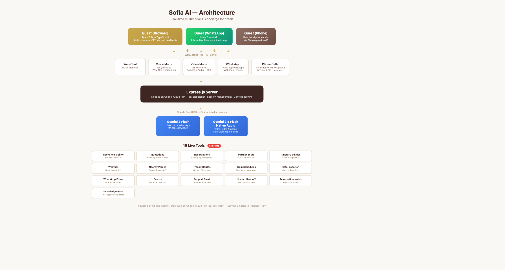

# Sofia AI — Live Multimodal Concierge for Hotels

**A live, multimodal AI concierge that sees, hears, and speaks with hotel guests across 5 channels — voice, video, phone calls, WhatsApp, and web chat — executing 23 live tools with Google Search grounding. Powered by Gemini Live API, deployed on Google Cloud Run.**

> Built for the [Gemini Live Agent Challenge](https://geminiliveagentchallenge.devpost.com/) — Category: **Live Agents**



## Live Demo

**[sofia-ai-942607221166.europe-west1.run.app](https://sofia-ai-942607221166.europe-west1.run.app)**

Deployed on Google Cloud Run (europe-west1). Try voice mode, video mode, or text chat — all features are live.

## The Problem

Hotel front desks are overwhelmed. Guests ask the same questions in 5 languages, calls go unanswered after hours, and booking inquiries slip through the cracks. Existing chatbots are text-only, turn-based, and disconnected from hotel systems.

## The Solution

Sofia is a **live, multimodal AI agent** that doesn't just answer questions — she *acts*. She checks real room availability, creates booking offers with payment links, looks up reservations by Booking.com confirmation codes, and sends follow-up messages on WhatsApp. She does this while speaking naturally, understanding what guests show her through their camera, and knowing their GPS location for directions.

### 5 Live Channels

| Channel | Technology | Capabilities |
|---------|-----------|-------------|
| **Voice Mode** | Gemini 2.5 Flash Native Audio via WebSocket | Real-time speech, affective dialog, proactive audio |
| **Video Mode** | Camera + Audio + GPS → Gemini Live | See menus, landmarks, documents; give directions from user's position |
| **Phone Calls** | SIP/RTP bridge → Gemini Live | Answer real hotel calls, G.711 audio conversion, caller identification |
| **WhatsApp** | Meta Cloud API + Interactive Flows | Voice/image messages, booking forms, tour selection, feedback |
| **Web Chat** | Gemini 3 Flash + rich cards | Text with booking options, maps, tours, itineraries, weather |

### 23 Live Tools (Real-time)

During any conversation — voice, video, phone, or text — Sofia executes real actions:

| Tool | What it does |
|------|-------------|
| `check_room_availability` | Real-time pricing across multiple properties via HotelInCloud API |
| `create_personalized_quotation` | Booking offers with direct payment links |
| `lookup_reservation` | Search by guest name, booking code, Booking.com/Expedia confirmation |
| `add_reservation_note` | Add staff notes to existing reservations |
| `get_partner_tours` | Search 50+ Florence tours via Bokun API with booking links |
| `build_itinerary` | Visual day-by-day itinerary cards |
| `trigger_whatsapp_flow` | Send interactive WhatsApp forms (booking, check-in, tours, feedback) |
| `google_search_grounding` | Real-time web search for current events, exhibitions, and local info |
| `get_current_weather` | Live weather data |
| `find_nearby_places` | Google Places API for restaurants, attractions, pharmacies |
| `get_public_transport_info` | Google Directions API for transit routes |
| `get_train_departures` | Real-time train schedules from Florence stations |
| `get_hotel_location` | Maps and walking directions to any property |
| `get_events_in_florence` | Local events calendar |
| `send_support_message` | Email to hotel reception |
| `get_human_handoff_links` | Contact info for human staff |
| `propose_knowledge_update` | AI-suggested knowledge base additions |
| `enable_proactive_companion` | Opt-in to Trip Intelligence Engine for personalized tips |
| `visual_identification` | Sofia Lens — AR landmark, menu, and object identification via camera |
| `compare_hotels` | Side-by-side property comparison with pricing and amenities |
| `save_guest_preferences` | Persist preferences across channels and sessions |
| `send_whatsapp_message` | Cross-channel WhatsApp with template fallback |
| `escalate_to_human` | Handoff to staff with full conversation context |

### Multimodal "See, Hear, Speak" Features

- **Affective Dialog** — Adapts tone based on guest emotional state (stressed guests get calmer responses)
- **Proactive Audio** — Intelligently interjects with helpful info during conversation pauses
- **Non-blocking Tool Calls** — Keeps talking while slow APIs execute, then interrupts with results
- **Sofia Lens (AR)** — Point camera at landmarks, menus, or objects for instant identification with AR overlay tags
- **Camera + GPS** — Guests show menus for translation, landmarks for identification, with location-aware directions
- **Screen Sharing** — Share browser tabs or documents for real-time visual understanding
- **Adjustable Speech Speed** — Normal (1x), slow (0.5x), or fast (1.5x)
- **Caller Identification** — Matches phone numbers to reservations, greets guests by name
- **Predictive Preferences** — Analyzes booking history (preferred hotel, room type, travel month)
- **Multilingual** — Auto-detects language from content or country code (Italian, English, French, German, Spanish)
- **WhatsApp Flows** — Native interactive forms for booking, check-in, tour selection, and feedback
- **Trip Intelligence Engine** — Proactive daily briefings, weather alerts, location-aware tips via WhatsApp/Web Push
- **Google Search Grounding** — Real-time web search for current Florence events and exhibitions

## Google Cloud Deployment Proof

[Watch the Cloud Run deployment video](cloud-run-deployment.mov) — shows the live service running on Google Cloud Run, Cloud Build history, and server logs.

## Architecture


### Key Architecture Decisions

- **Server-side AI only** — All Gemini API calls on the server. No API keys in client bundles.
- **Context caching** — 15k-token system instruction cached 1 hour via `GoogleAICacheManager` (~90% input token cost savings).
- **Non-blocking function calls** — Slow tools use `behavior: "NON_BLOCKING"` so Sofia continues talking while APIs respond, then uses `scheduling: "INTERRUPT"` to speak results immediately.
- **Dual Gemini models** — Gemini 3 Flash for text (1M context, reasoning), Gemini 2.5 Flash Native Audio for voice/video/phone (bidirectional streaming).
- **Phone index** — SHA-256 hash map of guest phones → reservation data, refreshed every 30 min for instant caller identification.

## Tech Stack

| Layer | Technology |
|-------|-----------|
| **AI Models** | Gemini 3 Flash (chat/WhatsApp), Gemini 2.5 Flash Native Audio (voice/video/phone) |
| **SDK** | `@google/genai` (GenAI SDK) + `@google/generative-ai` (cache manager) |
| **Backend** | Node.js 22, Express 5, WebSocket (`ws`) |
| **Frontend** | React 19, TypeScript, Tailwind CSS 4, Vite 6 |
| **Cloud** | Google Cloud Run (europe-west1), Artifact Registry |
| **APIs** | HotelInCloud, Google Maps/Places, Bokun Tours, Open-Meteo, Meta WhatsApp Cloud API |
| **Phone** | Node.js SIP/RTP bridge (G.711 u-law ↔ PCM resampling, 20ms pacing) |

## Getting Started

### Prerequisites

- Node.js 22+
- A [Gemini API key](https://aistudio.google.com/apikey)
- [gcloud CLI](https://cloud.google.com/sdk/docs/install) (for Cloud Run deployment — no Docker required)

### Local Development

```bash
# Clone the repo
git clone https://github.com/laurentisakaj/sofia-ai-hackathon.git
cd sofia-ai-hackathon

# Install dependencies
npm install

# Create .env from template
cp .env.example .env
# Edit .env and add your GEMINI_API_KEY and COOKIE_SECRET

# Run locally
npm start
```

The app runs at `http://localhost:5173` (frontend) proxying to `http://localhost:3000` (backend).

### Required Environment Variables

| Variable | Required | Description |
|----------|----------|-------------|
| `GEMINI_API_KEY` | Yes | Google Gemini API key |
| `COOKIE_SECRET` | Yes | Random 32-byte hex string for signed cookies |
| `DATA_ENCRYPTION_KEY` | No | AES-256 key for encrypting data at rest |
| `ENCRYPTION_SALT` | If encryption enabled | Salt for key derivation |
| `GOOGLE_MAPS_API_KEY` | No | For places and directions tools |
| `SMTP_HOST`, `SMTP_PORT`, `SMTP_USER`, `SMTP_PASS` | No | For email notifications |
| `HOTELINCLOUD_EMAIL`, `HOTELINCLOUD_PASSWORD`, `HOTELINCLOUD_TOTP_SECRET` | No | For live hotel booking integration |
| `WHATSAPP_ACCESS_TOKEN`, `WHATSAPP_APP_SECRET` | No | For WhatsApp channel |

### Deploy to Google Cloud Run

```bash
# One-click deployment (no Docker required — builds in the cloud)
./deploy-gcp.sh YOUR_PROJECT_ID europe-west1

# Then set your API key:
gcloud run services update sofia-ai \
  --region=europe-west1 --project=YOUR_PROJECT_ID \
  --set-env-vars="GEMINI_API_KEY=your_key,COOKIE_SECRET=$(openssl rand -hex 32)"
```

## Project Structure

```
sofia-ai-hackathon/
├── server.js                 # Express entry point, WebSocket servers
├── server_constants.js       # Hotel knowledge base
├── deploy-gcp.sh             # Automated Cloud Run deployment script
├── Dockerfile                # Multi-stage build for Cloud Run
├── backend/
│   ├── gemini.js             # System prompt, tool declarations, context caching
│   ├── tools.js              # executeToolCall() — central 23-tool dispatcher
│   ├── hotelincloud.js       # Hotel booking API client (auth, reservations, quotations)
│   ├── voiceHandler.js       # /ws/voice WebSocket (Gemini Live + camera + GPS)
│   ├── phoneHandler.js       # /ws/phone WebSocket (SIP phone calls)
│   ├── voiceShared.js        # Shared voice/phone utilities
│   ├── whatsapp.js           # WhatsApp Cloud API + templates
│   ├── flowScreens.js        # WhatsApp Flows screen handlers
│   ├── flowCrypto.js         # RSA-OAEP + AES-128-GCM encryption for Flows
│   ├── flowI18n.js           # Flow labels in 5 languages
│   ├── bokun.js              # Partner tour search (Bokun widget API)
│   ├── external.js           # Weather, places, transport, trains
│   ├── scheduler.js          # Cron tasks (check-in reminders, quotation follow-ups)
│   ├── guests.js             # Guest profile persistence
│   ├── phone.js              # Post-call actions (transcripts, WhatsApp follow-up)
│   └── email.js              # Email sending
├── routes/
│   ├── chat.js               # POST /api/chat — Gemini text chat with tool loop
│   ├── whatsapp.js           # WhatsApp webhook handler
│   ├── flows.js              # WhatsApp Flows data exchange endpoint
│   ├── admin.js              # Admin panel endpoints
│   ├── support.js            # Quotation and reservation endpoints
│   └── proxy.js              # Media proxy
├── lib/
│   ├── config.js             # Shared state, constants, AI clients
│   ├── encryption.js         # AES-256-GCM encryption, file locking
│   ├── language.js           # Language detection (content + phone country code)
│   ├── auth.js               # Admin authentication middleware
│   └── helpers.js            # Utility functions
├── components/
│   ├── ChatInterface.tsx     # Main chat UI with consent flow
│   ├── VoiceMode.tsx         # Voice/video mode (3D orb, camera, GPS, speed control)
│   ├── ConsentModal.tsx      # Permission consent modal (mic, camera, location)
│   ├── AttachmentCard.tsx    # Rich content cards (bookings, tours, maps, weather)
│   ├── AdminPanel.tsx        # Admin dashboard with analytics
│   └── ...
├── services/
│   ├── geminiService.ts      # Client-side API wrapper
│   ├── mapPinService.ts      # Map pin management
│   └── ...
└── .env.example              # Environment variable template
```

## How It Works

### Voice & Video Mode Flow

1. User taps microphone (voice) or camera (video) button → consent modal for permissions
2. Frontend captures audio via `getUserMedia`, streams PCM chunks over WebSocket to `/ws/voice`
3. In video mode: camera frames captured at 1 FPS as JPEG, GPS coordinates sent alongside
4. Server connects to Gemini Live API (`gemini-2.5-flash-native-audio-preview`) with bidirectional streaming
5. When Gemini calls a tool, server executes via `executeToolCall()` with `NON_BLOCKING` behavior
6. Sofia speaks results naturally, continues talking during slow API calls

### Phone Call Flow

1. Guest calls hotel → no answer → Messagenet VoIP forwards to Sofia
2. `sip-register.js` answers (SIP REGISTER + INVITE), extracts caller number
3. `sip-bridge.js` bridges RTP audio: G.711 u-law 8kHz → PCM 16kHz → WebSocket
4. Server proxies to Gemini Live with all 23 tools available
5. Caller identified? Sofia greets by name ("Buongiorno, Signor Rossi!")
6. After call: transcript emailed to staff, WhatsApp follow-up with booking link

### WhatsApp Flow

1. Guest sends message → Meta webhook → signature verification → rate limiting
2. Message type handling: text, voice transcription (Gemini), image understanding (Gemini)
3. Gemini chat session with all tools → rich reply with booking options, tour links, etc.
4. Interactive Flows: native WhatsApp forms for booking, check-in, tours, feedback
5. Mid-call WhatsApp: after phone quotation, auto-sends booking template to caller

## License

MIT
